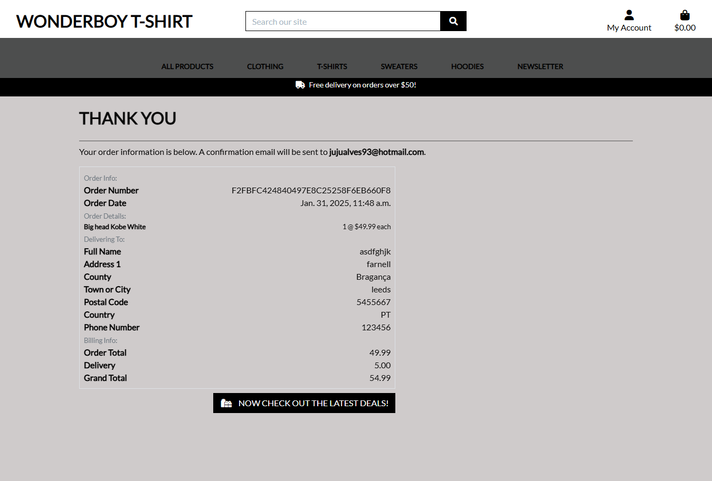
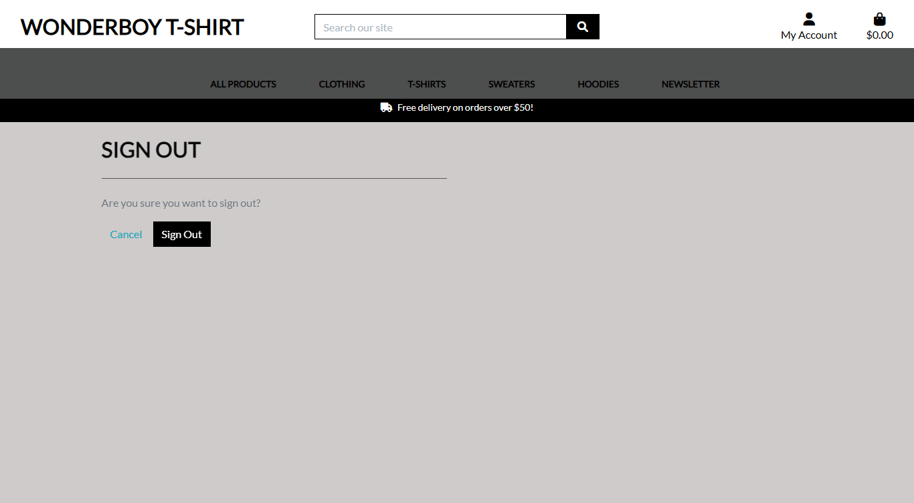

# Wonderbotshirt


Wonderboy T-Shirt is an e-commerce platform specializing in a wide range of custom-designed hoodies, t-shirts, and sweaters.

The primary purpose of the site is to offer users unique, high-quality apparel that reflects their personal style and individuality.

Visit the deployed website [here](https://wonderboytshirt-90045f83868e.herokuapp.com/).

## Table of Contents

1. [User Experience (UX)](#user-experience-ux)
    1. [Strategy](#strategy)
        1. [Project Goals](#project-goals)
        2. [User Goals](#user-goals)
    2. [Scope](#scope)
        1. [User Stories](#user-stories)
    3. [Structure](#structure)
        1. [Database Model](#database-model)
    4. [Surface](#surface)
        1. [Color Scheme](#color-scheme)
        2. [Typography](#typography)
2. [Features](#features)
   1. [General](#general)
   2. [Home Page](#home-page)
   3. [Products Page](#products-page)
   4. [Product Details Page](#product-details-page)
   5. [Products Admin](#products-admin)
   5. [Shopping Bag Page](#shopping-bag-page)
   6. [Checkout Page](#checkout-page)
   7. [Checkout Success Page](#checkout-success-page)
   8. [Profile Page](#profile-page)
   10. [Reviews Page](#reviews-page)
   11. [Reviews Admin](#reviews-admin)
   13. [Accounts Pages](#accounts-pages)
   14. [404 Error Page](#404-error-page)
4. [Technologies Used](#technologies-used)
    1. [Languages Used](#languages-used)
    2. [Libraries and Frameworks](#languages-and-frameworks)
    3. [Packages / Dependencies Installed](#packages--dependencies-installed)
    4. [Database Management](#database-management)
    5. [Payment Service](#payment-service)
    6. [Cloud Storage](#cloud-storage)
    7. [Tools and Programs](#tools-and-programs)
5. [Testing](#testing)
    1. [Go to TESTING.md]()
6. [Deployment](#deployment)
    1. [How To Use This Project](#how-to-use-this-project)  
    2. [Deployment to Heroku](#deployment-to-heroku)   
    3. [AWS Bucket Creation](#aws-bucket-creation)  
    4. [Connect Django to AWS Bucket](#connect-django-to-aws-bucket)
7. [Finished Product](#finished-product)
8. [Credits](#credits)
9. [Known Bugs](#known-bugs)
10. [Acknowledgements](#acknowledgements)


***

#### Project Goals

* Responsive Design: Ensures the website is accessible and functions seamlessly across various screen sizes and devices.

* User-Friendly Navigation: A well-structured layout allows customers to browse and shop effortlessly, enhancing their overall experience.

* Appealing Visuals: The website’s design and color scheme are carefully curated to attract and engage customers.

* Account Registration: Offers customers the option to create an account for a more personalized shopping experience.

* Streamlined Shopping Process: A simple and efficient shopping process ensures a pleasant and hassle-free experience for all users.

#### User Goals

**Epic 1 - Shopping Experience**

* As a shopper, I want to easily find the products and their details.

* As a shopper, I want to view products on a specific category.

* As a shopper, I want to be able to sort the products depending on their price, category or sub-category.

* As a shopper, I want to be able to search for products using specific keywords.

* As a shopper, I want to easily select the quantity of products to be purchased.

* As a buyer, I want to easily select the size of the products to be purchased.

* As a shopper, I want to easily view the current purchase amount.

**Epic 2 - Shopping Bag and Checkout**

* As a shopper, I want to view all items currently on my shopping bag and be able to update them.

* As a shopper, I want to easily provide my shipping and payment information during the checkout.

* As a shopper, I want to feel my personal and payment data is being handled securely.

* As a shopper, I want to receive an order confirmation once I have finished my purchase.

* As a shopper, I want to receive an order confirmation email for my records

**Epic 3 - User Accounts**

* As a frequent shopper, I want to be able to register an account using my email address to be able to keep my records and interact with the website.

* As a frequent shopper, I want to receive a confirmation once my account has been registered to make sure the information entered was correctly.

* As a registered shopper, I want to easily log in and out from my account.


* As a registered shopper, I want to have a personalized profile page where I can keep my contact information updated and see my past orders.

**Epic 4 - Product Reviews**

* As a shopper, I want to be able to read product reviews left by other shoppers.

* As a registered shopper, I want to be able to leave product reviews and rate the products.

**Epic 5 - Product Favourites**

As a user, I want to be able to add products to my favourites, so that I can easily view the products I have marked as favourites later.

As a user, I want to be able to remove products from my favourites, so that I can keep my favourites list up-to-date with only the products I am interested in.


**Epic 6 - Product Admin**

* As a site admin, I want to be able to add and update products.

* As a site admin, I want to be able to remove product no longer available.

**Epic 7 - Newsletter Subscription**

* As a site administrator, I want buyers to have the ability to provide their contact emails so we can keep them informed about new updates, promotions, and exclusive offers.

#### Database Model

The database model has been designed using [dbdiagram.io](https://dbdiagram.io/). The type of database being used for the is relational database being managed using SQLite3 during development and deployed using [PostgreSQL](https://www.postgresql.org/).


#### Wireframes

[Balsamiq](https://balsamiq.com/) has been used to showcase the appearance of the site and display the placement of the different elements whitin the pages.

Page | Desktop Version | Mobile Version
--- | --- | ---
Home |  | 
Products |  | 
Product Details |  | 
Shopping Bag |  | 
Checkout |  | 
Profile |  | 

#### Color Scheme


The website features a sleek slate color palette as the main background and foreground, complemented by shades of gray as the primary accent colors. This combination creates a clean and modern aesthetic.

#### Typography

The font used across the site is Lato, with sans-serif as the fallback. This clean and modern typography ensures readability and enhances the overall user experience.


[Back to top ⇧](#wonderboytshirt)

## Features


### General

* The website has been designed from a mobile first perspective.

* Responsive design across all device sizes.


#### Header


* The header contains the main logo, navigation links, and product search functionality.

* The main logo acts as a link to the homepage, allowing users to easily return to the main page.

* The navigation links provide shoppers with access to all sections of the website, ensuring easy navigation. Additionally, the navbar includes different tabs to help customers find products based on their categories, offering an intuitive and well-organized shopping experience. The links feature a hover effect that changes color, providing visual feedback to enhance the user experience.

* The shopping bag icon is prominently displayed on the website. Whenever a product is added to the shopping cart, the total value of the items is dynamically updated, keeping customers informed in real time and ensuring a seamless shopping experience. 


#### Search Bar


* The search bar allows the user to search the website for products using specific keywords.

* The search can is hidden at first for better visuals and can be toggled using the search icon link in case the shopper needs.


#### Footer


* "About Us" Section: Offers a brief description of the brand and its mission, highlighting personalized products such as t-shirts, hoodies, and other unique fashion items.

* Payments Processing: Explains how payments are securely handled through the Stripe system, ensuring a smooth and 
  trustworthy shopping experience.

* Contact Us: Includes the email, phone number and address for user to get to access us.

* Social Media Connections: Provides quick access to the brand's social media platforms, such as Facebook, Instagram,    and  YouTube, allowing users to stay updated with the latest news and promotions.

* Copyright and Branding: Features a copyright notice for Wonderboy T-Shirt, adding a professional and informative touch.

### Home Page


* Hero section contains links to the shopping page.


### Products Page


* Display all the products currently available or filtered on a specific category.

* Display an image of the products as well as their main information such as name, price and rating.

* Display the quantity of products currently being displayed.

* A back button is available to the shopper can easily come back to the all products.

* Provides sorting functionality to sort products by price, rating, name or category.

* A back to the top button is available so the shopper can easily come back to the top of the page.


### Product Details Page


* A products navigation bar is available in case the shopper wants to return to the products list.

* Display a larger image of the product along with its detailed information.

* A favorites icon is provided, allowing the shopper to easily add the product to their favorite products.

* Allow the user to select the quantity of the product to be added to the shopping bag.

* Allow the user to choose the size of the product before adding it to the cart.

* A "Keep Shopping" button is available to navigate back to the product list.

* An "Add to Bag" button is provided to add the selected quantity of the product to the shopping bag.

* A reviews link is available, showing how many reviews the product has received, and allows toggling the reviews 
  section.

* All reviews for the product are displayed in the reviews section at the bottom of the page.

* The "Count Section for Reviews" displays the total number of product reviews.

* A link to leave a review is available at the bottom of the reviews section, "Add Review".

* Provide edit and delete links for the logged-in shopper to manage their own reviews.

### Products Admin

#### Add Product


* Provide a form for the site admin to be able to add new products to the store.

#### Edit Product


* Provide a pre-filled form that allows the site admin to update products in the store.

#### Delete Product


* Provide a page to delete a product.


### Shopping Bag Page


* A message alerts the user if the free delivery threshold has not been reached, displaying the remaining amount needed 
  to qualify for free delivery.

* Display all products currently in the shopping bag, along with their details.

* Allow the user to update the product quantity or remove items from the shopping bag.

* Display the current total cost, including the bag total and delivery fees.

* Provide a "Continue Shopping" button for the user to go back to the products.

* Include a checkout button for the shopper to complete the purchase.


### Checkout Page


* Provide a checkout form for the shopper to complete the purchase, including the necessary contact, shipping, and 
  payment information.

* Display an order summary that lists all the products to be purchased, along with their total cost, including the bag 
  total and delivery fees.

* Provide a link back to the shopping bag for the shopper to adjust the products before finalizing the purchase.

* Display a message informing the shopper of the amount to be charged to the provided card.

* Show descriptive error messages in case there are issues with the payment information provided.

* Ensure a clear button is available for the shopper to complete the order.

* Implement a Stripe webhook handler in the backend to pass the order information if the browser crashes during         checkout  completion.


### Checkout Success Page


*Display the order and shopper information, allowing the shopper to confirm that the details are correct.

*Additionally, inform the shopper that a confirmation email has been sent to the provided email address with the same 
 information.


### Profile Page


* Provide a form that allows the registered shopper to update their default information.

* A section displaying the order history is available, showing all past orders for the registered shopper.

### Reviews Page


* Display the reviews the registered shopper has provided and the review's information.

* Links to edit and delete the reviews are present for each review.

* A link to go back to products are display.


### Reviews Admin

#### Add Review


* Display the product being reviewed.

* Provide a form that allows the registered shopper to add a review for the product.

* A link to go back to products are display.

#### Edit Review


* Provide a pre-filled form for the registered shopper to update their existing reviews.

* A link to go back to products are display.


### Accounts Pages

Page | Purpose | Image |
--- | --- | --- |
Sign Up | Allow the shopper to sign up an account for the website. |  |
Sign In | Allow the registered shopper to sign in with their account. |  |
Sign Out | Allow the registered shopper to sign out from their account. |  |


[Back to top ⇧](#Wonderboytshirt)


## Technologies Used


### Languages Used

* [HTML5](https://en.wikipedia.org/wiki/HTML)
* [CSS3](https://en.wikipedia.org/wiki/CSS)
* [JavaScript](https://en.wikipedia.org/wiki/JavaScript)
* [Python](https://en.wikipedia.org/wiki/Python_(programming_language))


### Libraries and Frameworks

* [Django](https://www.djangoproject.com/) was used as web framework.

* [Django Template](https://jinja.palletsprojects.com) was used as a templating language for Django to display backend data to HTML.
   
* [Bootstrap 5](https://getbootstrap.com/docs/5.0/getting-started/introduction/) was used throughout the website to help with styling and responsiveness.

* [Google Fonts](https://fonts.google.com) was used to import the font into the html file, and were used on all parts of the site.

* [Font Awesome](https://fontawesome.com) was used throughout the website to add icons for aesthetic and UX purposes. 

* [jQuery 3.6.0](https://jquery.com/) was used as a JavaScript library to help writing less JavaScript code. 


### Packages / Dependencies Installed

* [Django Allauth](https://django-allauth.readthedocs.io/en/latest/) was used for user authentication, registration, and account management.

* [Django Crispy Form](https://django-crispy-forms.readthedocs.io/en/latest/) was used to control the rendering of the forms. 

* [Django Countries](https://pypi.org/project/django-countries/) was used to provide country choices for use with forms and a country field for models.

* [Pillow](https://pypi.org/project/Pillow/) was used to add image processing capabilities.  
 
* [Gunicorn](https://gunicorn.org/) was used as Python WSGI HTTP Server for UNIX to support the deployment of Django application.  


### Database Management
* [SQLite](https://www.sqlite.com/index.html) was used as a single-file database during development.

* [Heroku Postgres](https://www.heroku.com/postgres) database was used in production, as a service based on PostgreSQL provided by Heroku.


### Payment Service

   * [Stripe](https://stripe.com/en-gb-nl) was used to process all online payments transactions.


### Cloud Storage

* [Amazon Web Service S3](https://aws.amazon.com/s3/) was used to store all static and media files in production.  

### Tools and Programs

* [Git](https://git-scm.com)  
    * Git was used for version control by utilizing the Gitpod terminal to commit to Git and Push to GitHub. 

* [GitPod](https://gitpod.io/)
     * GitPod was used for writing code, committing, and then pushing to GitHub.

* [GitHub](https://github.com)  
   GitHub was used to store the projects code after being pushed from Git. 

* [Heroku](https://www.heroku.com)   
    * Heroku was used to deploy the website.

* [Coolors](https://coolors.co)  
    * Coolors was used to create a color scheme for the website.

* [Balsamiq](https://balsamiq.com/)
     * Balsamiq was used to create the wireframes during the design phase of the project

* [Chrome DevTools](https://developer.chrome.com/docs/devtools/)
    * Chrome DevTools was used during development process for code review and to test responsiveness.

* [W3C Markup Validator](https://validator.w3.org/)
    * W3C Markup Validator was used to validate the HTML code.

* [W3C CSS Validator](https://jigsaw.w3.org/css-validator/)
    * W3C CSS Validator was used to validate the CSS code.

* [JSHint](https://jshint.com/) 
    * The JSHints JavaScript Code Quality Tool was used to validate the site's JavaScript code.


[Back to top ⇧](#Wonderboytshirt)


## Testing

## Testing

The **testing documentation** was conducted and can be found in the file `TESTING.md` in the project's root directory.


[Back to top ⇧](#Wonderboytshirt)

## Deployment
 
The project was developed using a GitPod workspace (https://www.gitpod.io/). The code was committed to Git (https://www.git-scm.com/) and pushed to GitHub (https://www.github.com/) using the terminal. The web application is deployed on Heroku (https://www.heroku.com/), as GitHub Pages (https://pages.github.com/) cannot host a Python project. Static and media files are stored in AWS S3 (https://aws.amazon.com/s3/), and the repository is hosted on GitHub (https://www.github.com/).


### How To Use This Project
To use and further develop this project, you can either fork or clone the repository.  


#### Fork GitHub Repository
Forking a GitHub repository allows you to create a copy of the original repository under your GitHub account, enabling you to view and/or make changes without affecting the original repository. To do this, follow these steps:

1. Log in to GitHub.  
2. Navigate to the main page of the GitHub Repository that you want to fork.  
3. At the top right of the Repository just below your profile picture, locate the "Fork" button.  
4. You should now have a copy of the original repository in your GitHub account.  
5. Changes made to the forked repository can be merged with the original repository via a pull request.  


#### Clone Github Repository
Cloning a GitHub repository allows you to create a local copy of the remote repository on your computer. The developer who clones the repository can synchronize their local copy with any updates made by fellow developers through push or pull requests. To clone a repository, follow these steps:

1. Log in to GitHub.  
2. Navigate to the main page of the GitHub Repository that you want to clone.  
3. Above the list of files, click the dropdown called "Code".  
4. To clone the repository using HTTPS, under "HTTPS", copy the link.  
5. Open Git Bash.  
6. Change the current working directory to the location where you want the cloned directory to be made.  
7. Type git clone, and then paste the URL you copied in Step 4.  
```$ git clone https://github.com/YOUR-USERNAME/YOUR-REPOSITORY```
8. Press Enter. Your local clone will be created.   
```
$ git clone https://github.com/YOUR-USERNAME/YOUR-REPOSITORY
> Cloning into `CI-Clone`...
> remote: Counting objects: 10, done.
> remote: Compressing objects: 100% (8/8), done.
> remove: Total 10 (delta 1), reused 10 (delta 1)
> Unpacking objects: 100% (10/10), done.
```  
Changes made on the local machine (cloned repository) can be pushed directly to the upstream repository if you have write access. Otherwise, changes are first pushed to the forked repository, and then a pull request is created to propose merging those changes into the upstream repository.  
Click [Here](https://docs.github.com/en/github/creating-cloning-and-archiving-repositories/cloning-a-repository-from-github/cloning-a-repository) to retrieve pictures for some of the buttons and more detailed explanations of the above process.  


#### Project Set Up After Forking or Cloning  
1. Install all dependencies by typing in the CLI ```pip3 install -r requirements.txt```  
2. Create a ```.gitignore``` file and ```env.py``` file in the project's root directory. Add the ```env.py``` file to ```.gitignore```. 
3. Inside the env.py file, enter the project's environment variables:   
   ```
   import os

   os.environ.setdefault("SECRET_KEY", <your_secret_key>)
   os.environ.setdefault("DEVELOPMENT", '1')
   os.environ.setdefault("STRIPE_PUBLIC_KEY", <your_key>)
   os.environ.setdefault("STRIPE_SECRET_KEY", <your_key>)
   os.environ.setdefault("STRIPE_WH_SECRET", <your_key>)
   ```   
   You can get the keys from:
   - "SECRET_KEY" can be generated using [Django Secret Key Generator](https://miniwebtool.com/django-secret-key-generator/)   
   - "STRIPE_PUBLIC_KEY" and "STRIPE_SECRET_KEY" can be generated by creating a stripe account. The keys are found in 'Developers' Section, under 'API Keys'.  
   - In the Developer Section, under 'Webhooks', add a new endpoint.  "STRIPE_WH_SECRET". On Endpoint URL, enter:  
   ``` https://<your_host_url>/checkout/wh/ ```   
   Select to listen to all events, and create endpoint, and you can view your "STRIPE_WH_SECRET".   

4. Make migrations to setup the inital database operations.  
   ``` 
   python3 manage.py makemigrations 
   python3 manage.py migrate 
   ```   
5. Load data for the database or create data manually. 
   ```
   python3 manage.py loaddata <app_name>
   ``` 
6. Create a super user.
   ```
   python3 manage.py create superuser
   ```  
The project should now complete to run and can now be used for development. To run the project, type in the CLI terminal: ```python3 manage.py runserver```     


### Deployment to Heroku 
This project is deployed on Heroku for production, with all static and media files stored on AWS S3. Here are the steps to deploy the project on Heroku:

1. Navigate to Heroku.com, create a new account or login if you already have an account. On the dashboard page, click "Create New App" button. Give the app a name, the name must be unique with hypens between words. Set the region closest to you, and click "Create App".   
2. On the resources tab, provision a new Heroku Postgres database.  
3. Configure variables on Heroku by navigating to Settings, and click on Reveal Config Vars. You may not have all the values yet. Add the others as you progress through the steps.   
   Varables | Key   
   ---| ---   
   AWS_ACCESS_KEY_ID | your_access_key_id_from_AWS   
   AWS_SECRET_ACCESS_KEY | your_secret_access_key_from_AWS  
   DATABASE_URL | your_database_url   
   EMAIL_HOST_PASS | your_app_password_from_your_email   
   EMAIL_HOST_USER | your_email_address  
   SECRET_KEY | your_secret_key 
   STRIPE_PUBLIC_KEY | your_stripe_public_key  
   STRIPE_SECRET_KEY | your_stripe_secret_key  
   USE_AWS | True 

4. If you haven't install it, install dj_database_url and psycopg2.
   ```
   pip3 install dj_database_url
   pip3 install psycopg2-binary
   ```
   Note: you don't have to do this if you've installed all dependencies in the requirements.txt file.  
5. Set up a new database for the site by going to the project's settings.py and importing dj_database_url. Comment out the database's default configuration, and replace the default database with a call to dj_database_url.parse and pass it the database URL from Heroku (you can get it from your config variables in your app setting tab)
   ```
   DATABASES = {
     'default': dj_database_url.parse('YOUR_DATABASE_URL_FROM_HEROKU')
   }
   ```
6. Run migrations
   ```
   python3 manage.py migrate
   ```  
7. Import data to the database.
    - Make sure your manage.py file is connected to your sqlite3 database.
    - Use this command to backup your current database and load it into a db.json file:
    ```
    ./manage.py dumpdata --exclude auth.permission --exclude contenttypes > db.json
    ```
    - Connect your manage.py file to your postgres database
    - Then use this command to load your data from the db.json file into postgres:
    ``` 
    ./manage.py loaddata db.json
    ``` 
8. Set up a new superuser, fill out the username, email address, and password.
   ```
   python3 manage.py create superuser
   ```  
9. Remove the database config from Heroku and uncomment the original config. Add a conditional statement to define that when the app is running on Heroku. we connect to Postgres, and otherwise, we connect to Sqlite.   
   ```
   if 'DATABASE_URL' in os.environ:
      DATABASES = {
         'default': dj_database_url.parse(os.environ.get('DATABASE_URL'))
      }
   else:
      DATABASES = {
         'default': {
            'ENGINE': 'django.db.backends.sqlite3',
            'NAME': BASE_DIR / 'db.sqlite3',
         }
      }
   ```  
10. Install gunicorn which will act as the webserver, and put it on the requirements.txt.   
   ``` 
   pip3 install gunicorn
   pip3 freeze > requirements.txt
   ```
   Note: you don't have to do this if you've installed all dependencies in the requirements.txt file.
11. Create a Procfile, to tell Heroku to create a web dyno, which will run unicorn and serve the Django app.   

   Inside the Procfile:
   ```
   web: gunicorn shoes_and_more.wsgi:application
   ```
12. Login to Heroku through CLI, using ```heroku login```. Once logged in, disable the collect static temporarily, so that Heroku won't try to collect static files when it deploys.
   ```
   heroku config:set DISABLE_COLLECTSTATIC=1 --app shoes-and-more
   ```
   And add the hostname of the Heroku app to allowed hosts in the project's settings.py, and also add localhost so that Gitpod will still work as well:  
   ```
   ALLOWED_HOSTS = ['shoes-and-more.herokuapp.com', 'localhost']
   ```   
13. Add, commit, and push to gitpod and then to Heroku. After pushing to gitpod as usual, initialize git remote first:
   ```
   heroku git:remote -a shoes-and-more
   ``` 
   Then push to Heroku:
   ```
   git push heroku main
   ```
14. Go to the app's dashboard on Heroku and go to Deploy. Connect the app to Github by clicking Github and search for the repository. Click connect. Also enable the automatic deploy by clicking Enable Automatic Deploys, so that everytime we push to github, the code will automatically be deployed to Heroku as well.  
15. Go back to settings.py and replace the secret key setting with the call to get it from the environment, and use empty string as a default. 
   ```
   SECRET_KEY = os.environ.get('SECRET_KEY', '')
   ```
   Set debug to be true only if there's a variable called development in the environment.
   ```
   DEBUG = 'DEVELOPMENT' in os.environ
   ```
  

### AWS Bucket Creation   
All static and media files for this project are stored in an Amazon Web Services (AWS) S3 bucket, a cloud-based storage service. You can create your own S3 bucket by following these steps: 
1. Go to [Amazon Web Service website](https://aws.amazon.com/) and click on Create An AWS Account, or login if you already have an account.  
2. Login to your new account, go to AWS Management Console and find service S3. Click on Create Bucket.   
   - Give it a name (I recommend naming your bucket to match the Heroku app name), and choose region closest to you.  
   - In Object Ownership section, choose ACLS enabled. and Bucket Owner Preffered.   
   - Uncheck box 'Block All Public Access'.  
   - Check box 'I acknowledge that the current settings might result in this bucket and the objects within becoming public.'  
   - Click on Create Bucket, and your bucket is created.  
3. Click on your newly created bucket, and navigate to the Properties tab. Scroll down to the bottom until you find Static Website Hosting. Click on Edit, then enable. 
   - Hosting type: choose Host a Static Website   
   - Index document: index.html  
   - Error document: error.html
   - Click on Save Changes.  
4. Navigate to the Permissions tab. Scroll down to the bottom until you find Cross-origin resource sharing (CORS). Click on Edit, and paste in this Cors Configuration below, which is going to set up the required access between the Heroku app and this S3 bucket. Click on Save Changes. 
   ```
   [
      {
         "AllowedHeaders": [
            "Authorization"
         ],
         "AllowedMethods": [
            "GET"
         ],
         "AllowedOrigins": [
            "*"
         ],
         "ExposeHeaders": []
      }
   ]
   ```   
   Still on the Permissions tab, find Bucket policy, click on Edit, and then go to Policy Generator. 
   - Select Type of Policy: choose S3 Bucket Policy   
   - Effect: choose Allow   
   - Principal: *   
   - Actions: select GetObject   
   - Fill in the Amazon Resource Name (ARN), from the Bucket ARN back in the Bucket Policy   
   - Click on the Add Statement and then Generate Policy. Copy the policy and paste in the bucket policy editor.  
   - Add a slash star on to the end of the resource key (because we want to allow access to all resources in this bucket). Click Save.
      The resource key should look like this
      ```  
      "Resource": "arn:aws:s3:::YOUR_BUCKET_NAME/*",  
      ```  
   
   Still on Permissions tab, go to Access Control List (ACL) section, click Edit and enable List for Everyone (public access), and accept the warning box.  

5. With the bucket ready, now we need to create a user to access it through another service called IAM which stands for Identity and Access Management. Go back to the service menu and open IAM.   
   a. Create a group for our user to live in.  
      Click User Groups, and then create a new group with a name you want. I gave the group the name: manage-shoes-and-more. Scroll down to the bottom and click on Create Group.     
   b. Create an access policy giving the group access to the S3 bucket that has been created.  
      - Click on Policy, and then Create Policy. Go to the JSON tab, and then select import managed policy, which will let us import one that AWS has pre-built for full access to S3. Search for S3, then import the AmazonS3FullAccess policy.   
      - Because we only want to allow full access to our new bucket and everything within it, paste the bucket ARN (from the bucket policy page in s3) in the JSON editor.
      ```
      "Resource": [
         "arn:aws:s3:::YOUR_BUCKET_NAME",
         "arn:aws:s3:::YOUR_BUCKET_NAME/*"
      ]
      ```  
      Now click on Next:Tags, then click Next:Review. 
      - Give the review policy a name and a description, then click Create Policy. The policy has now been created. 
      
   c. Finally, assign the user to the group so it can use the policy to access all our files.  
      - Go to User Groups, and select the group. Go to the Permissions tab, open the Add Permissions dropdown, and click Attach Policies.  
      - Select the policy and click Add permissions at the bottom.  
      - Create a user to put in the group, by going to the Users page, and clicking Add Users.  
      - Set a user name, give them access type: Programmatic access, and then click Next: Permissions.   
      - Check on the group that has the policy attached. Click Next: Tags, then click Next: Review, and lastly Create User.     
      - Download the csv file and save it.  


### Connect Django to AWS Bucket 
Note: If you've forked the repository, all of these steps have already been completed and written in the files. Ensure that you've installed all dependencies from the requirements.txt file, added the necessary AWS-related Config Vars to Heroku, and removed the DISABLE_COLLECTSTATIC variable from Heroku.  
Here are the steps I followed to connect Django to AWS:  
1. Install two new packages: boto3 and django-storages. Freeze them into requirements.txt.   
   ```
   pip3 install boto3
   pip3 install django-storages 
   pip3 freeze > requirements.txt  
   ```  
2. Add storages to the Installed Apps in settings.py.
3. In settings.py, we need to configure cache control, set bucket configurations, specify the locations for static and media files, and override the static and media URLs in production. Since we only want to apply these settings on Heroku, we'll also need to add an if statement to ensure they are only executed in that environment.
   ```
   if 'USE_AWS' in os.environ:
      # Cache control
      AWS_S3_OBJECT_PARAMETERS = {
         'Expires': 'Thu, 31 Dec 2099 20:00:00 GMT',
         'CacheControl': 'max-age=94608000',
      }

      # Bucket Config
      AWS_STORAGE_BUCKET_NAME = 'YOUR_BUCKET_NAME'
      AWS_S3_REGION_NAME = 'YOUR_REGION'
      AWS_ACCESS_KEY_ID = os.environ.get('AWS_ACCESS_KEY_ID')
      AWS_SECRET_ACCESS_KEY = os.environ.get('AWS_SECRET_ACCESS_KEY')
      AWS_S3_CUSTOM_DOMAIN = f'{AWS_STORAGE_BUCKET_NAME}.s3.amazonaws.com'

      # Static and media files
      STATICFILES_STORAGE = 'custom_storages.StaticStorage'
      STATICFILES_LOCATION = 'static'
      DEFAULT_FILE_STORAGE = 'custom_storages.MediaStorage'
      MEDIAFILES_LOCATION = 'media' 

      # Override static and media URLs in production
      STATIC_URL = f'https://{AWS_S3_CUSTOM_DOMAIN}/{STATICFILES_LOCATION}/'
      MEDIA_URL = f'https://{AWS_S3_CUSTOM_DOMAIN}/{MEDIAFILES_LOCATION}/'
   ```
   Set the Config Vars on Heroku. On your app's dashboard on Heroku, go to Settings and click Reveal Convig Vars. Set this variables:
   Variables | Value
   --- | ---
   AWS_ACCESS_KEY_ID | your access key id from the csv file that you've downloaded before
   AWS_SECRET_ACCESS_KEY | your secret access key from the csv file that you've downloaded before
   USE_AWS | True    

   Also remove the COLLECTSTATIC variable from the Config Vars.   

4. Next, we need to configure Django to use S3 for storing static files whenever collectstatic is run, and ensure that any uploaded images are also stored there.

Create a custom_storages.py file in your project's root directory, and inside it, define the Static and Media Storage locations.
   ```
   from django.conf import settings
   from storages.backends.s3boto3 import S3Boto3Storage
 

   class StaticStorage(S3Boto3Storage):
      location = settings.STATICFILES_LOCATION


   class MediaStorage(S3Boto3Storage):
      location = settings.MEDIAFILES_LOCATION
   ```  

5. Finally, push these changes on Github.
   ```
   git add .
   git commit -m "Your commit message"
   git push
   ```


[Back to top ⇧](#Wonderboytshirt)


## Finished Product

Page | Desktop | Mobile |
--- | --- | --- |
| Home |  |  |
| Products |  |  |
| Product Details |  |  |
| Shopping Bag |  |  |
| Checkout |  |  |
| Checkout Success |  |  |
| Profile |  |  |
| Reviews |  |  |


[Back to top ⇧](#Wonderboytshirt)


## Credits

### Media


### Code

* The code from Code Institute's video on the Boutique Ado project served as the primary reference for setting up an e-commerce/online store project, utilizing HTML, CSS, JavaScript, Python with Django, a PostgreSQL database, Stripe for payments, and AWS S3 for storage.


## Known Bugs

**Upload the static files to S3 using collectstatic comand**

When attempting to deploy the static files to Heroku, I encountered a build error. I resolved the issue by adding the following line in my settings.py: STATIC_ROOT = 'tmp_static_files'
After making this adjustment, I was able to successfully deploy the application.

**Manually Uploading Static Files to S3**

Although I configured STATIC_ROOT in my settings.py, I encountered issues with uploading the static files automatically in the future. As a result, I opted to upload the files manually through the Gitpod terminal using the following command: aws s3 cp s3://wonderboytshirt/static/css/base.css ./base.css.

**Reviews Were Not Deleted When Associated Product Was Deleted**

Fortunately, this turned out to be a simple issue. I just needed to update the on_delete option for the foreign key in my review model. I changed: on_delete=models.SET_NULL to: on_delete=models.CASCADE.
After making this change, I ran the migration, and the issue was resolved.

**My Favourites Page Was Appearing Empty Even After Adding Products to Favourites**

This issue was a bit tricky at first, but I eventually identified the root cause. The problem stemmed from the fact that the favourites were not being properly listed in the template. After reviewing the code, I realized that the necessary logic to display the favourites was missing in the template file. Once I added the correct template logic to list the favourite products, the issue was resolved.

**Product Reviews Not Appearing After Adding, Despite Being Present in the Database**

During testing, I encountered an issue where the product reviews I was adding were not appearing after refreshing the page, even though I could see the reviews when checking the database using the shell command. After some investigation, I realized the issue was due to the missing import of the review model in the product reviews file. Once I added the necessary import, the reviews started displaying correctly on the page.


[Back to top ⇧](#Wonderboytshirt)

## Acknowledgements

* My Family, for their unconditional love and patience, help and continued support through the whole course. Without their support I would not  been able to finish this project.

* My tutor, Marcel, for his support, feedback and guidance throughout this project. 

* I would like to express my gratitude to my friend, Dorivaldo Butte, for his invaluable support and for creating and designing the products.

* I would like to thank my friend, Ricardo Soares, for his assistance in resolving CSS issues in my project, particularly for his help with challenges I encountered.

* Code Institute and Slack community for their support and providing me with the necessary knowledge to complete this project.

* Special mention and thanks to my mentor, Rachel Furlong, for her support, invaluable insights and her belief that I can do this well. I am so grateful to have you as my mentor.

# *Copyrights*
&copy; 2024 wonderboy T-shirts by Joeline Alves (An e-commerce Full Stack Developer Project)

[Back to top ⇧](#Wonderboytshirt)