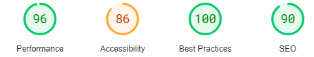

# Wonderboytshirt Testing

[Back to the README.md file](/README.md)  

[View the live website here](https://wonderboytshirt-90045f83868e.herokuapp.com/)  

## Table of Contents

1. [Testing User Stories](#testing-user-stories)
2. [Code Validation](#code-validation)
3. [Accessibility](#accessibility)
4. [Tools Testing](#tools-testing)
5. [Manual Testing](#manual-testing)

***

## Testing User Stories

### Epic 1 - Shopping Experience

#### As a shopper, I want to easily find the products and their details.

* Products page is available, displaying the products and their main details.

#### As a shopper, I want to view products on a specific category.

* Links to each product category are provided in the home page.

* A product navigation bar is present in the products page, allowing the shopper to filter products per category.

#### As a shopper, I want to be able to sort the products depending on their price, rating or category.
* A sorting functionality is provided in the products page, allowing the shopper to sort products by price, name, rating and category.

#### As a shopper, I want to be able to search for products using specific keywords.

* A search bar is available on the website header, allowing the shopper to find a product by keyword across the whole website.

#### As a shopper, I want to easily select the quantity of products to be purchased.

* Quantity field is available in the product details page, allowing the shopper to select the desired product quantity before adding the product to the shopping bag.

#### As a shopper, I want to easily select the size of products to be purchased.

* Size field is available in the product details page, allowing the shopper to select the desired product size before adding the product to the shopping bag.

#### As a shopper, I want to easily view the current purchase amount.

* The current purchase amount is available under the shopping cart icon in the header, making the information available across the whole website.

### Epic 2 - Shopping Bag and Checkout

#### As a shopper, I want to view all items currently on my shopping bag and be able to update them.
* Products added to the shopping bag are displayed in the shopping bag page.

* A quantity form is available in the shopping bag page for the shopper to update the product quantity.

#### As a shopper, I want to easily provide my shipping and payment information during the checkout.

* A form is available at the checkout for the shopper to provide the necessary information to complete the purchase.

#### As a shopper, I want to feel my personal and payment data is being handled securely.

* Stripe payments has been implemented as a payment method for the website in order to provide secure and easy transactions for the shoppers.

#### As a shopper, I want to receive an order confirmation once I have finished my purchase.

* A checkout success page is displayed to the shopper after completing the purchase.

#### As a shopper, I want to receive an order confirmation email for my records.

* An email is being sent to the email address provided by the shopper during the checkout.

### Epic 3 - shopper Accounts

#### As a frequent shopper, I want to be able to register an account using my email address to be able to keep my records and interact with the website.

* All-auth has been implemented to handle user authentication, allowing the user to register an account.

#### As a registered shopper, I want to easily log in and out from my account.

* All-auth has been implemented to handle user authentication, allowing the user to easily login and logout from their account.

#### As a registered shopper, I want to have a personalized profile page where I can keep my contact information updated and see my past orders.

* A profile page is available for the shopper to keep their contact information updated as well as access their past orders.

### Epic 4 - Product Reviews

#### As a shopper, I want to be able to read product reviews left by other shoppers.

* Product reviews are available in the product details page for each product.

#### As a shopper, I want to be able to sort the reviews by date or rating.

* A sorting functionality has been provided for the reviews for the shopper to sort the reviews either by date or rating.

#### As a registered shopper, I want to be able to leave product reviews and rate the products.

* Forms are available for registered shoppers if to review and rate products.

* Registered shoppers are also able to update or delete their existing reviews.

### Epic 5 - Product Admin

#### As a site admin, I want to be able to add and update products.

* Full CRUD functionality has been implemented for site admins to manage the website products.

#### As a site admin, I want to be able to remove product no longer available.

* Full CRUD functionality has been implemented for site admins to manage the website products.

### Epic 6 - Newsletter Subscription

#### As a site admin, I want shoppers to be able to provide their contact email information to be able to reach out to them with information and offers.

* A newsletter subscription form is prominently placed in the navigation bar, ensuring shoppers can easily subscribe from anywhere on the site.

## Code Validation

### HTML

* [W3C Markup Validator](https://validator.w3.org/) found no errors on my HTNL files.

### CSS
* [W3C CSS Validator](https://jigsaw.w3.org/css-validator/) found no errors on my CSS files.

### Python

Pylint was utilized consistently during the development process to analyze Python code and identify potential programming errors.

Additionally, the code was checked for errors using the terminal command python3 -m flake8. This process highlighted several whitespace and indentation issues, which were promptly addressed where possible to ensure clean and maintainable code.

### Javascript

* [JSHint](https://jshint.com/) found a total of 6 warnings concerning missing or unnecessary semicolons. These warnings were corrected.

## Accessibility

Lighthouse in Chrome DevTools has been used to confirm that the colors and fonts being used throughout the website are easy to read and accessible. See reports in the table below:

### Lighthouse Reports

Page | Lighthouse Report |
| --- | --- |
| Home |  |
| Products |  |
| Product Details |  |
| Add Product |  |
| Edit Product |  |
| Shopping Bag !|  |
| Checkout |  |
| Checkout Success |  |
| Profile |  |
| Reviews |  |
| Add Review |  |
| Edit Review |  |

The low score on the best practices seems to be coming from the cookies.

## Tools Testing

### [Chrome DevTools](https://developer.chrome.com/docs/devtools/)

* Chrome DevTools was extensively used throughout the development process to test, inspect, and modify HTML elements and CSS styles, ensuring the project met design and functionality requirements.

### Responsiveness

* Chrome DevTools was utilized during the development process to test and ensure the website's responsiveness across various screen sizes.

## Manual Testing

### Browser Compatibility

Browser | Outcome | Pass/Fail | 
--- | --- | --- |
Google Chrome | No appearance, responsiveness nor functionality issues. | Pass |
Safari | No appearance, responsiveness nor functionality issues. | Pass |
Mozilla Firefox | No responsiveness nor functionality issues. | Pass |
Microsoft Edge | No appearance, responsiveness nor functionality issues. | Pass |

### Device Compatibility

Device | Operative System |Outcome | Pass/Fail
--- | --- | --- | --- |
Dell Optiplex 7060 | Windows 11 | No appearance, responsiveness nor functionality issues. | Pass |
MacBook Pro 15" | macOS Big Sur | No appearance, responsiveness nor functionality issues. | Pass |
Dell Latitude 5300 | Windows 10 | No appearance, responsiveness nor functionality issues. | Pass |
iPad Pro 12.9" | iOS 15 | No appearance, responsiveness nor functionality issues. | Pass |
iPad Pro 10.5" | iOS 15 |No appearance, responsiveness nor functionality issues. | Pass |
iPhone XR | iOS 15 |No appearance, responsiveness nor functionality issues. | Pass |
iPhone 7 | iOS 15 |No appearance, responsiveness nor functionality issues. | Pass |

**Note**

The appearance of the product quantity form on the shopping bag page can be improved on smaller devices.

### Test Results

#### General

Element | Expected Outcome | Pass/Fail |
--- | --- | --- |
Main Logo Link | Clicking the link redirects to the home page. | Pass |
Shop Link | Clicking the link redirects to the products page. | Pass |
My Account Icon - Register Link | Clicking the link redirects to the account sign up page. | Pass |
My Account Icon - Login Link | Clicking the link redirects to the account sign in page. | Pass |
My Account Icon - Logout link | Clicking the link redirects to the account sign out page. | Pass |
My Account Icon - Product Management Link | Clicking the link redirects to the add product page. | Pass |
My Account Icon - My Profile Link | Clicking the link redirects to the profile page. | Pass |
My Account Icon - My Favourites Link | Clicking the link redirects to the favourites page. | Pass |
Shopping Cart Icon | Clicking the link redirects to the shopping cart. | Pass |
Search Bar | Clicking the link redirects to the products page and display the matching products. | Pass |
Facebook Icon | Clicking the link open the business Facebook page on a separate tab. | Pass |
Newsletter Form | Email address gets registered to the database when submitting the form. | Pass |

#### Home Page

Element | Expected Outcome | Pass/Fail |
--- | --- | --- |
Categories Links | Clicking any of the links will redirect to the products page and filter the products on that category. | Pass |

#### Products Page

Element | Expected Outcome | Pass/Fail |
--- | --- | --- |
Product Navigation Bar Links | Clicking any of the links will filter the products on that category. | Pass |
Sort By Selector | Sort by functionality sort the products depending on the selection. | Pass |
Product Edit Link | Clicking the link redirects to the edit product page. | Pass |
Product Delete Link | Clicking the link delete the product from the database. | Pass |

#### Product Details Page

Element | Expected Outcome | Pass/Fail |
--- | --- | --- |
Product Navigation Bar Links | Clicking any of the links will redirect to the products page and filter the products on that category. | Pass
Product Image | Clicking the image opens it on a separate tab. | Pass |
Favorites Icon | Clicking the icon toggle the product on the favorites database. | Pass |
Product Edit Link | Clicking the link redirects to the edit product page. | Pass |
Product Delete Link | Clicking the link deletes the product from the database. | Pass |
Decrease Quantity Button | Decreases the quantity on the input form. | Pass |
Increase Quantity Button | Increases the quantity on the input form. | Pass |
Select Size Button | Select the size on the input form. | Pass |
Keep Shopping Button | Clicking the button redirects to the products page. | Pass |
Add To Bag Button | Clicking the button adds the specified quantity of the product to the shopping bag. | Pass |
Reviews Link | Clicking the link toggle the product reviews. | Pass |
Review Edit Link | Clicking the link redirects to the edit review page. | Pass |
Review Delete Link | Clicking the link delete the review from the database. | Pass |
Leave A Review Button | Clicking the button redirects to the add review page. | Pass |

#### Add Product Page

Element | Expected Outcome | Pass/Fail |
--- | --- | --- |
Select Image Button | Clicking the button allows to add an image to the form | Pass |
Add Product Form | Product gets registered to the database when submitting the form. | Pass |
Cancel Button | Clicking the button redirects to the products page. | Pass |

#### Edit Product Page

Element | Expected Outcome | Pass/Fail |
--- | --- | --- |
Select Image Button | Clicking the button allows to add or replace the image | Pass |
Edit Product Form | Product gets updated when submitting the form. | Pass |
Cancel Button | Clicking the button redirects to the products page. | Pass |

#### Shopping Bag Page

Element | Expected Outcome | Pass/Fail |
--- | --- | --- |
Decrease Quantity Button | Decreases the quantity on the input form. | Pass |
Increase Quantity Button | Increases the quantity on the input form. | Pass |
Select Size Button | Select the size on the input form. | Pass |
Update Link | Clicking the link update the product quantity on the shopping bag. | Pass
Delete Link | Clicking the link removed the product from the shopping bag. | Pass
Keep Shopping Button | Clicking the button redirects to the products page. | Pass |
Secure Checkout Button | Clicking the button redirects to the checkout page. | Pass |

#### Checkout Page

Element | Expected Outcome | Pass/Fail |
--- | --- | --- |
Checkout Form | An order gets created when submitted the form. | Pass |
Login Link | Clicking the link redirects to the account sign in page. | Pass |
Register Link | Clicking the link redirects to the account sign up page. | Pass |
Save Information Check | Checking the box update the user's profile information during the checkout process. | Pass |
Adjust Bag Link | Clicking the link redirects to shopping bag page. | Pass |

#### Profile Page

Element | Expected Outcome | Pass/Fail |
--- | --- | --- |
Update Information Form | User's information gets updated when submitting the form. | Pass |
Order Link | Clicking the link redirects to order view. | Pass |

#### Favorites Page
Element | Expected Outcome | Pass/Fail |
--- | --- | --- |
Remove Link | Clicking the link removes the product from the user's favorites list. | Pass |

#### Reviews Page
Element | Expected Outcome | Pass/Fail |
--- | --- | --- |
Product Link | Clicking the link redirect to the product details page. | Pass |
Edit Link | Clicking the link redirect to the edit review page. | Pass |
Delete Link | Clicking the link deletes the review from the database. | Pass |

#### Add Review Page

Element | Expected Outcome | Pass/Fail |
--- | --- | --- |
Add Review Form | Review gets registered to the database when submitting the form. | Pass |
Cancel Button | Clicking the button redirects to the product details page. | Pass |

#### Edit Review Page

Element | Expected Outcome | Pass/Fail |
--- | --- | --- |
Edit Review Form | Review gets updated when submitting the form. | Pass |
Cancel Button | Clicking the button redirects to the products page. | Pass |

